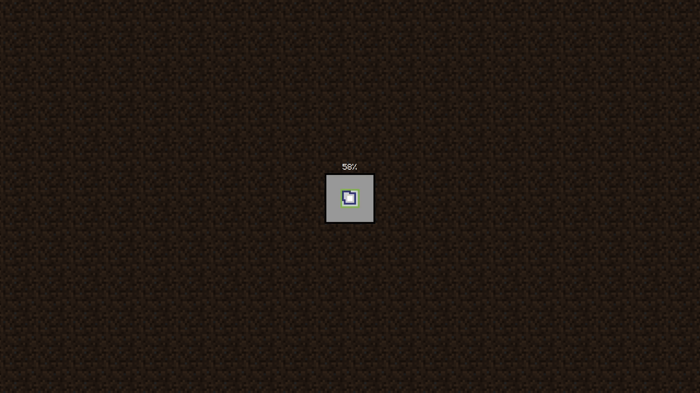

# Minecraft World Loading KDE Splash
A Plasma Splashscreen resembling the minecraft world loading animation.



## Installation
### Manual Installation
clone this repository to the location where KDE stores splash screens:
```sh
git clone https://github.com/Samsu-F/minecraftworldloading-kde-splash ~/.local/share/plasma/look-and-feel/minecraftworldloading-kde-splash
```
After that, open your settings, go to splash screens, and select it.

### Installing through KDE Store
Open your settings, go to splash screens, and click on "Get New..." in the top right corner. Then search for "Minecraft World Loading" and you should be able to find and install this splash screen.

---
If you like this splash screen, please leave a like in the KDE Store. You can find it here: https://store.kde.org/p/2301954.

## Also check out these other projects:
- [Minegrub Main Menu Theme](https://github.com/Lxtharia/minegrub-theme) by Lxtharia
- [Minegrub World Selection Theme](https://github.com/Lxtharia/minegrub-world-sel-theme) by Lxtharia
- [Minecraft SDDM Theme](https://github.com/Davi-S/sddm-theme-minesddm) by Davi-S
- [Minecraft Plymouth Theme](https://github.com/nikp123/minecraft-plymouth-theme) by nikp123
